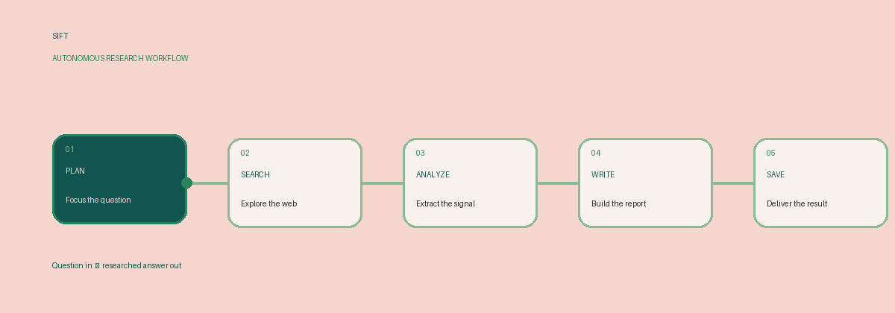

<div align="center">

# S I F T

### AUTONOMOUS RESEARCH AGENT

<br>

**Research, without the busywork.**

<br>

Give SIFT a topic worth exploring.

It plans the research, searches the web, extracts the signal,
and turns the results into a structured report.

<br>

`PLAN` → `SEARCH` → `ANALYZE` → `WRITE` → `SAVE`

</div>

---

<div align="center">



</div>

---

## What is SIFT?

SIFT is an autonomous research agent built with **LangGraph**.

Instead of asking an LLM to generate a research answer in a single call, SIFT breaks the task into explicit stages:

1. **Planner** — turns the topic into 3–5 focused search queries.
2. **Searcher** — sends each query to Tavily and collects web results.
3. **Analyzer** — extracts useful facts from the collected results.
4. **Writer** — turns those facts into a structured research report.
5. **Saver** — writes the validated report to `report.md`.

The workflow is controlled by a LangGraph `StateGraph`, so the intermediate state and execution path are explicit rather than hidden inside one large prompt.

---

## ◈ The Architecture

```mermaid
flowchart TD

    A["Research Topic"] --> B["Planner"]
    B -->|"3–5 queries"| C["Searcher"]
    C -->|"Tavily results"| D["Analyzer"]
    D -->|"Key facts"| E["Writer"]

    E --> F{"Valid report?"}

    F -->|"Yes"| G["Saver"]
    G --> H["report.md"]

    F -->|"No + retries available"| B
    F -->|"Retry limit reached"| I["End"]
